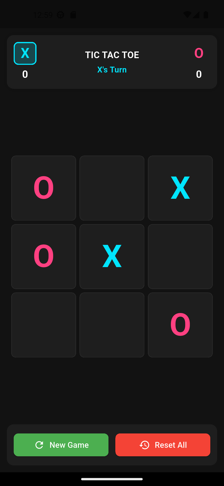
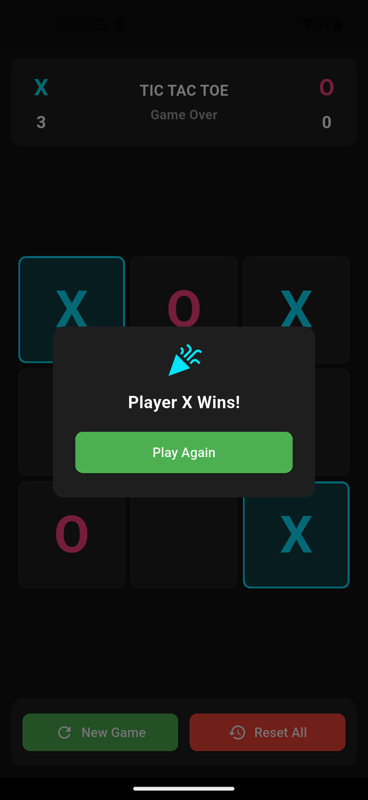

# Tic Tac Toe Game

A modern, responsive Tic Tac Toe game built with Flutter. Features a sleek dark theme, real-time score tracking, and smooth animations. Play against a friend on the same device and enjoy the clean Material 3 design.

[](https://flutter.dev)
[](https://dart.dev)

## Screenshots

| Gameplay | Win Dialog |
|----------|------------|
|  |  |

*(Replace the image paths with actual screenshots when available)*

## Features

- ✨ **Two‑player gameplay** – Play X and O on the same device.
- 🏆 **Live score tracking** – Scores persist during the session.
- 🎨 **Modern dark theme** – Eye‑candy with neon accents (cyan for X, pink for O).
- 📱 **Responsive layout** – Adapts perfectly to any screen size.
- ✅ **Winner detection** – Automatically highlights the winning combination.
- 🤝 **Draw handling** – Displays a friendly dialog when the board fills up.
- 🔄 **Game controls** – Reset the current board or clear all scores with one tap.
- ⚡ **Smooth animations** – Animated cell transitions and dialog appearances.

## Getting Started

### Prerequisites

- [Flutter SDK](https://flutter.dev/docs/get-started/install) (version 3.16 or later)
- [Dart SDK](https://dart.dev/get-dart) (comes with Flutter)
- An IDE (VS Code, Android Studio, or IntelliJ)

### Installation

1. **Clone the repository**
   ```bash
   git clone https://github.com/yourusername/tic_tac_toe.git
   ```

2. **Navigate to the project directory**
   ```bash
   cd tic_tac_toe
   ```

3. **Install dependencies**
   ```bash
   flutter pub get
   ```

4. **Run the app**
   ```bash
   flutter run
   ```

> **Note:** The app works on Android, iOS, web, and desktop.

## How to Play

- The game starts with **O** as the first player (indicated by the highlighted player icon).
- Tap any empty cell to place your mark.
- The turn alternates automatically.
- The first player to get three marks in a row (horizontally, vertically, or diagonally) wins.
- If all nine cells are filled without a winner, the game declares a draw.
- Use the **New Game** button to reset the board while keeping the scores.
- Use the **Reset All** button to clear both the board and the scores.

## Project Structure

```
lib/
└── main.dart               # Single‑file application (all logic and UI)
```

The entire game is contained in one file for simplicity. You can easily refactor it into separate components if desired.

## Built With

- **Flutter** – UI toolkit from Google.
- **Material 3** – Modern design language with theming support.
- **Dart** – Programming language optimized for UI.

## Customization

Feel free to tweak the appearance:

- **Colors**: Modify the `Color` constants in `ThemeData` and the widget styles.
- **Grid size**: Adjust the `cellSize` calculation in the `build` method.
- **Animations**: Change the `Duration` in `AnimatedSwitcher` and dialog delays.

## Contributing

Contributions are welcome! If you find a bug or have an idea for an improvement:

1. Fork the repository.
2. Create your feature branch (`git checkout -b feature/AmazingFeature`).
3. Commit your changes (`git commit -m 'Add some AmazingFeature'`).
4. Push to the branch (`git push origin feature/AmazingFeature`).
5. Open a Pull Request.

## License

Distributed under the MIT License. See `LICENSE` for more information.

---

Enjoy the game! If you like this project, give it a ⭐ on GitHub.
